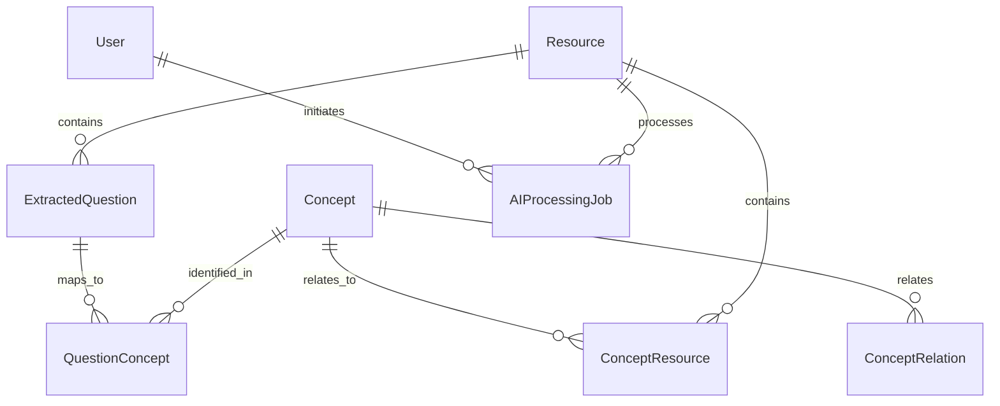

# Phase 1: AI-Powered Past Questions Analysis & RAG System - Database Schema & Infrastructure

## 🎯 Overview

This document provides a comprehensive implementation guide for Phase 1 of the AI-Powered Past Questions Analysis & RAG System. Phase 1 focuses on establishing the foundational database schema and infrastructure required to support intelligent question analysis, concept mapping, and retrieval-augmented generation (RAG) capabilities.

## 📋 Implementation Scope

### Core Objectives

1. **Database Schema Design**: Create comprehensive models for question extraction, concept mapping, and AI processing
2. **Infrastructure Setup**: Establish the foundational data structures for RAG system
3. **Relationship Mapping**: Define complex relationships between questions, concepts, and resources
4. **AI Integration Preparation**: Set up data models to support AI processing workflows
5. **Performance Optimization**: Design efficient indexes and query structures

## 🗄️ Database Schema Implementation

### 1. ExtractedQuestion Model

**Purpose**: Stores individual questions extracted from uploaded past question papers using AI analysis.

```prisma
model ExtractedQuestion {
  id                Int                 @id @default(autoincrement())
  resourceId        Int                 // Reference to original uploaded document
  resource          Resource            @relation(fields: [resourceId], references: [id], onDelete: Cascade)

  // Question Content
  questionText      String              @db.Text // Full question text
  questionNumber    String?             // e.g., "1(a)", "Question 2"
  sectionTitle      String?             // Section/chapter name if available

  // Question Metadata
  marks             Int?                // Total marks allocated
  timeEstimate      Int?                // Estimated time in minutes
  difficulty        QuestionDifficulty  @default(MEDIUM)
  questionType      QuestionType        @default(WRITTEN)

  // AI Analysis Results
  aiAnalysis        Json                // Raw AI analysis data
  aiConfidence      Float               @default(0.0) // AI confidence in extraction (0-1)
  extractionMethod  ExtractionMethod    @default(AI_POWERED)

  // Concept Relationships
  concepts          QuestionConcept[]   // Many-to-many with concepts

  // Additional Metadata
  pageNumber        Int?                // Page in original document
  positionOnPage    Json?               // Coordinates for image-based docs
  originalFormat    String?             // PDF, JPG, PNG, etc.

  // Audit Fields
  createdAt         DateTime            @default(now())
  updatedAt         DateTime            @updatedAt
  createdBy         Int?                // User who triggered extraction
  user              User?               @relation(fields: [createdBy], references: [id])

  // Performance Indexes
  @@index([resourceId, difficulty])
  @@index([createdAt])
  @@index([questionType, difficulty])
  @@map("extracted_questions")
}
```

### 2. Concept Model

**Purpose**: Central repository for academic concepts identified across all questions and resources.

```prisma
model Concept {
  id                  Int                 @id @default(autoincrement())

  // Core Concept Information
  name                String              @unique // e.g., "Linear Algebra", "Photosynthesis"
  slug                String              @unique // URL-friendly version
  description         String?             @db.Text
  shortDescription    String?             // Brief summary (160 chars max)

  // Hierarchical Structure
  parentConceptId     Int?                // For concept hierarchies
  parentConcept       Concept?            @relation("ConceptHierarchy", fields: [parentConceptId], references: [id])
  childConcepts       Concept[]           @relation("ConceptHierarchy")
  level               Int                 @default(1) // Hierarchy depth

  // Classification
  category            String              // e.g., "Mathematics", "Physics", "Chemistry"
  subcategory         String?             // e.g., "Calculus", "Mechanics", "Organic"
  academicLevel       AcademicLevel       @default(UNDERGRADUATE)
  difficulty          ConceptDifficulty   @default(INTERMEDIATE)

  // AI-Generated Content
  aiSummary           String?             @db.Text // AI-generated explanation
  aiKeyPoints         Json?               // Structured key points
  aiPrerequisites     Json?               // Required prior knowledge
  aiApplications      Json?               // Real-world applications

  // Relationships
  questions           QuestionConcept[]   // Many-to-many with questions
  resources           ConceptResource[]   // Many-to-many with resources
  relatedConcepts     ConceptRelation[]   @relation("ConceptRelations")
  inverseRelations    ConceptRelation[]   @relation("InverseConceptRelations")

  // Metadata
  frequency           Int                 @default(0) // How often concept appears
  importance          Float               @default(0.5) // Calculated importance score
  lastAIUpdate        DateTime?           // Last time AI content was refreshed

  // Tags and Keywords
  tags                Json?               // Searchable tags
  keywords            Json?               // Alternative names/synonyms

  // Audit Fields
  createdAt           DateTime            @default(now())
  updatedAt           DateTime            @updatedAt
  createdBy           Int?
  user                User?               @relation(fields: [createdBy], references: [id])

  // Performance Indexes
  @@index([category, subcategory])
  @@index([academicLevel, difficulty])
  @@index([parentConceptId])
  @@index([name, slug])
  @@fulltext([name, description, shortDescription])
  @@map("concepts")
}
```

### 3. QuestionConcept Junction Model

**Purpose**: Links questions to concepts with AI-determined confidence scores and relationship metadata.

```prisma
model QuestionConcept {
  id                  Int                 @id @default(autoincrement())

  // Foreign Keys
  questionId          Int
  question            ExtractedQuestion   @relation(fields: [questionId], references: [id], onDelete: Cascade)
  conceptId           Int
  concept             Concept             @relation(fields: [conceptId], references: [id], onDelete: Cascade)

  // Relationship Metadata
  confidence          Float               @default(0.0) // AI confidence (0-1)
  relevanceScore      Float               @default(0.5) // How relevant concept is to question
  isMainConcept       Boolean             @default(false) // Primary vs secondary concept
  conceptRole         ConceptRole         @default(CORE) // How concept relates to question

  // AI Analysis Data
  aiReasoning         String?             @db.Text // Why AI linked these
  aiKeywords          Json?               // Keywords that triggered the link
  extractionContext   String?             // Specific text that identified concept

  // Question-Specific Context
  relevantText        String?             @db.Text // Specific part of question relating to concept
  conceptApplication  String?             // How concept is applied in this question
  difficultyInContext ConceptDifficulty?  // Difficulty of concept within this question

  // Validation and Quality
  humanVerified       Boolean             @default(false)
  verifiedBy          Int?
  verifier            User?               @relation(fields: [verifiedBy], references: [id])
  verificationDate    DateTime?

  // Audit Fields
  createdAt           DateTime            @default(now())
  updatedAt           DateTime            @updatedAt

  // Constraints and Indexes
  @@unique([questionId, conceptId])
  @@index([questionId, isMainConcept])
  @@index([conceptId, confidence])
  @@index([conceptRole, relevanceScore])
  @@map("question_concepts")
}
```

### 4. ConceptResource Junction Model

**Purpose**: Maps concepts to existing platform resources with relevance scoring and content extraction.

```prisma
model ConceptResource {
  id                  Int                 @id @default(autoincrement())

  // Foreign Keys
  conceptId           Int
  concept             Concept             @relation(fields: [conceptId], references: [id], onDelete: Cascade)
  resourceId          Int
  resource            Resource            @relation(fields: [resourceId], references: [id], onDelete: Cascade)

  // Relevance Scoring
  relevanceScore      Float               @default(0.0) // AI-calculated relevance (0-1)
  qualityScore        Float               @default(0.5) // Content quality assessment
  comprehensiveness   Float               @default(0.5) // How completely resource covers concept

  // Content Analysis
  extractedContent    String?             @db.Text // Relevant sections extracted by AI
  contentSummary      String?             @db.Text // AI summary of relevant content
  keyQuotes           Json?               // Important quotes/passages

  // Resource Mapping Details
  pageReferences      Json?               // Specific pages/sections
  chapterReferences   Json?               // Relevant chapters
  contentType         ResourceContentType // Type of relevant content

  // AI Processing Metadata
  aiAnalysisDate      DateTime?           // When AI last analyzed this mapping
  aiProcessingTime    Int?                // Processing time in milliseconds
  aiModel             String?             // AI model used for analysis
  aiVersion           String?             // Model version

  // Usage Statistics
  accessCount         Int                 @default(0) // How often this mapping is accessed
  studentRating       Float?              // Average student rating of relevance
  ratingCount         Int                 @default(0)

  // Quality Control
  humanReviewed       Boolean             @default(false)
  reviewedBy          Int?
  reviewer            User?               @relation(fields: [reviewedBy], references: [id])
  reviewDate          DateTime?
  reviewNotes         String?             @db.Text

  // Audit Fields
  createdAt           DateTime            @default(now())
  updatedAt           DateTime            @updatedAt

  // Constraints and Indexes
  @@unique([conceptId, resourceId])
  @@index([conceptId, relevanceScore])
  @@index([resourceId, qualityScore])
  @@index([contentType, relevanceScore])
  @@map("concept_resources")
}
```

### 5. ConceptRelation Model

**Purpose**: Defines relationships between concepts (prerequisite, related, opposite, etc.).

```prisma
model ConceptRelation {
  id                  Int                 @id @default(autoincrement())

  // Foreign Keys
  fromConceptId       Int
  fromConcept         Concept             @relation("ConceptRelations", fields: [fromConceptId], references: [id], onDelete: Cascade)
  toConceptId         Int
  toConcept           Concept             @relation("InverseConceptRelations", fields: [toConceptId], references: [id], onDelete: Cascade)

  // Relationship Details
  relationType        ConceptRelationType // PREREQUISITE, RELATED, BUILDS_ON, etc.
  strength            Float               @default(0.5) // Relationship strength (0-1)
  bidirectional       Boolean             @default(false) // Whether relationship works both ways

  // AI Analysis
  aiDetected          Boolean             @default(true) // Whether AI detected this relationship
  aiConfidence        Float               @default(0.0) // AI confidence in relationship
  aiReasoning         String?             @db.Text // AI explanation for relationship

  // Metadata
  description         String?             @db.Text // Human description of relationship
  examples            Json?               // Examples illustrating the relationship

  // Validation
  humanVerified       Boolean             @default(false)
  verifiedBy          Int?
  verifier            User?               @relation(fields: [verifiedBy], references: [id])

  // Audit Fields
  createdAt           DateTime            @default(now())
  updatedAt           DateTime            @updatedAt

  // Constraints and Indexes
  @@unique([fromConceptId, toConceptId, relationType])
  @@index([fromConceptId, relationType])
  @@index([toConceptId, relationType])
  @@index([relationType, strength])
  @@map("concept_relations")
}
```

### 6. AIProcessingJob Model

**Purpose**: Tracks background AI processing jobs for question analysis and concept extraction.

```prisma
model AIProcessingJob {
  id                  String              @id @default(uuid())

  // Job Details
  jobType             AIJobType           // QUESTION_EXTRACTION, CONCEPT_MAPPING, etc.
  resourceId          Int?                // Resource being processed (if applicable)
  resource            Resource?           @relation(fields: [resourceId], references: [id], onDelete: Cascade)
  userId              Int                 // User who initiated the job
  user                User                @relation(fields: [userId], references: [id])

  // Job Status
  status              ProcessingStatus    @default(PENDING)
  progress            Int                 @default(0) // Progress percentage (0-100)
  currentStep         String?             // Current processing step
  totalSteps          Int?                // Total number of steps

  // Results and Data
  results             Json?               // Processing results
  inputData           Json?               // Input parameters
  outputData          Json?               // Structured output

  // Error Handling
  errorMessage        String?             @db.Text
  errorCode           String?
  retryCount          Int                 @default(0)
  maxRetries          Int                 @default(3)

  // Performance Metrics
  startTime           DateTime?
  endTime             DateTime?
  processingDuration  Int?                // Duration in milliseconds

  // AI Model Information
  aiModel             String?             // AI model used
  modelVersion        String?             // Model version
  apiCost             Float?              // Processing cost (if applicable)
  tokensUsed          Int?                // Tokens consumed

  // Job Configuration
  configuration       Json?               // Job-specific settings
  priority            JobPriority         @default(NORMAL)
  parentJobId         String?             // For job chains
  childJobs           AIProcessingJob[]   @relation("JobHierarchy")
  parentJob           AIProcessingJob?    @relation("JobHierarchy", fields: [parentJobId], references: [id])

  // Audit Fields
  createdAt           DateTime            @default(now())
  updatedAt           DateTime            @updatedAt

  // Indexes
  @@index([status, createdAt])
  @@index([userId, jobType])
  @@index([resourceId, status])
  @@index([priority, status])
  @@map("ai_processing_jobs")
}
```

### 7. Enhanced Resource Model

**Purpose**: Extends existing Resource model to support past question papers and RAG content.

```prisma
// Extensions to existing Resource model
model Resource {
  // ... existing fields ...

  // Past Question Paper Support
  isPastQuestion      Boolean             @default(false)
  academicYear        String?             // e.g., "2023-2024"
  examPeriod          String?             // e.g., "Semester 1", "Final Exam"
  examDuration        Int?                // Duration in minutes
  totalMarks          Int?                // Total marks for the paper

  // AI Processing Status
  aiProcessingStatus  ProcessingStatus?   @default(PENDING)
  lastAIProcessing    DateTime?
  aiProcessingJobId   String?             // Current or last processing job

  // RAG System Support
  ragContent          String?             @db.Text // Processed content for RAG
  ragEmbedding        Json?               // Vector embeddings (if storing in DB)
  ragMetadata         Json?               // Additional RAG metadata
  ragLastUpdated      DateTime?           // Last RAG content update

  // Content Analysis
  extractedQuestions  ExtractedQuestion[]
  conceptMappings     ConceptResource[]
  aiProcessingJobs    AIProcessingJob[]

  // Document Structure
  documentStructure   Json?               // Parsed document structure
  pageCount           Int?                // Number of pages
  wordCount           Int?                // Estimated word count

  // Quality Metrics
  extractionQuality   Float?              // Quality score for text extraction
  ocrConfidence       Float?              // OCR confidence (for images)
  contentReliability  Float?              // Overall content reliability score

  // Additional Indexes for Past Questions
  @@index([isPastQuestion, aiProcessingStatus])
  @@index([academicYear, examPeriod])
  @@index([courseId, isPastQuestion])
}
```

## 🔧 Enums and Types

### Database Enums

```prisma
enum QuestionDifficulty {
  VERY_EASY
  EASY
  MEDIUM
  HARD
  VERY_HARD
}

enum QuestionType {
  MULTIPLE_CHOICE
  TRUE_FALSE
  SHORT_ANSWER
  ESSAY
  CALCULATION
  DIAGRAM
  WRITTEN
  PRACTICAL
}

enum ExtractionMethod {
  MANUAL
  OCR_BASIC
  AI_POWERED
  HYBRID
}

enum ConceptDifficulty {
  BEGINNER
  INTERMEDIATE
  ADVANCED
  EXPERT
}

enum AcademicLevel {
  HIGH_SCHOOL
  UNDERGRADUATE
  GRADUATE
  POSTGRADUATE
  PROFESSIONAL
}

enum ConceptRole {
  CORE           // Main concept being tested
  SUPPORTING     // Supporting concept needed
  APPLICATION    // Concept applied in solution
  BACKGROUND     // Background knowledge
  METHODOLOGY    // Method or technique used
}

enum ConceptRelationType {
  PREREQUISITE   // A requires B first
  BUILDS_ON      // A builds upon B
  RELATED        // A and B are related
  SIMILAR        // A is similar to B
  OPPOSITE       // A is opposite to B
  EXAMPLE_OF     // A is an example of B
  PART_OF        // A is part of B
  LEADS_TO       // A leads to B
}

enum ProcessingStatus {
  PENDING
  IN_PROGRESS
  COMPLETED
  FAILED
  CANCELLED
  PAUSED
}

enum AIJobType {
  QUESTION_EXTRACTION
  CONCEPT_MAPPING
  RESOURCE_MATCHING
  RAG_INDEXING
  CONTENT_ANALYSIS
  SIMILARITY_CALCULATION
  SUMMARY_GENERATION
}

enum JobPriority {
  LOW
  NORMAL
  HIGH
  URGENT
}

enum ResourceContentType {
  TEXTBOOK_CHAPTER
  LECTURE_NOTES
  VIDEO_TRANSCRIPT
  RESEARCH_PAPER
  TUTORIAL
  EXERCISE_SOLUTION
  REFERENCE_MATERIAL
}
```

## 📊 Database Relationships Overview

### Primary Relationships



### Key Relationship Patterns

1. **Question-Concept Many-to-Many**

   - One question can test multiple concepts
   - One concept can appear in multiple questions
   - Confidence scores and relationship metadata

2. **Concept-Resource Many-to-Many**

   - One concept can be covered by multiple resources
   - One resource can cover multiple concepts
   - Relevance scoring and content extraction

3. **Hierarchical Concepts**

   - Self-referencing hierarchy for concept organization
   - Support for nested concept structures
   - Inheritance of properties through hierarchy

4. **Processing Job Chains**
   - Jobs can spawn child jobs
   - Dependency tracking between processing steps
   - Parallel and sequential processing support

## 🚀 Performance Optimizations

### Database Indexes

```sql
-- Primary performance indexes
CREATE INDEX idx_extracted_questions_resource_difficulty ON extracted_questions(resource_id, difficulty);
CREATE INDEX idx_question_concepts_confidence ON question_concepts(concept_id, confidence DESC);
CREATE INDEX idx_concept_resources_relevance ON concept_resources(concept_id, relevance_score DESC);
CREATE INDEX idx_ai_jobs_status_priority ON ai_processing_jobs(status, priority, created_at);

-- Full-text search indexes
CREATE INDEX idx_concepts_fulltext ON concepts USING GIN(to_tsvector('english', name || ' ' || description));
CREATE INDEX idx_questions_fulltext ON extracted_questions USING GIN(to_tsvector('english', question_text));

-- Composite indexes for common queries
CREATE INDEX idx_concepts_category_level ON concepts(category, academic_level, difficulty);
CREATE INDEX idx_resources_course_pastquestion ON resources(course_id, is_past_question, ai_processing_status);
```

### Query Optimization Strategies

1. **Batch Operations**

   - Bulk insert for extracted questions
   - Batch processing for concept mappings
   - Optimized updates for processing status

2. **Caching Layers**

   - Frequently accessed concepts
   - Popular question-concept mappings
   - AI processing results

3. **Partitioning Considerations**
   - Partition large tables by date
   - Separate hot and cold data
   - Archive old processing jobs

## 🔐 Data Security and Privacy

### Access Control

```prisma
// User permissions for AI features
model UserAIPermissions {
  id                  Int                 @id @default(autoincrement())
  userId              Int                 @unique
  user                User                @relation(fields: [userId], references: [id])

  canAnalyzeQuestions Boolean             @default(false)
  canEditConcepts     Boolean             @default(false)
  canReviewMappings   Boolean             @default(false)
  canAccessRAG        Boolean             @default(true)

  createdAt           DateTime            @default(now())
  updatedAt           DateTime            @updatedAt
}
```

### Data Protection

- **Encryption**: Sensitive AI analysis data encrypted at rest
- **Anonymization**: Personal identifiers removed from processing logs
- **Audit Trail**: Complete history of data modifications
- **Access Logging**: Track all AI system interactions

## 📈 Monitoring and Analytics

### Processing Metrics

```prisma
model ProcessingMetrics {
  id                  Int                 @id @default(autoincrement())
  date                DateTime            @default(now()) @db.Date

  questionsExtracted  Int                 @default(0)
  conceptsIdentified  Int                 @default(0)
  resourcesMapped     Int                 @default(0)

  averageAccuracy     Float               @default(0.0)
  processingTime      Int                 @default(0) // in milliseconds
  errorRate           Float               @default(0.0)

  @@unique([date])
  @@map("processing_metrics")
}
```

### Quality Metrics

- **Extraction Accuracy**: Percentage of correctly extracted questions
- **Concept Mapping Precision**: Accuracy of concept identification
- **Resource Relevance**: Quality of resource-concept mappings
- **Processing Performance**: Speed and efficiency metrics

## 🧪 Data Validation and Quality Control

### Validation Rules

```typescript
// Data validation schemas
const QuestionValidation = z.object({
  questionText: z.string().min(10).max(5000),
  difficulty: z.enum(["VERY_EASY", "EASY", "MEDIUM", "HARD", "VERY_HARD"]),
  marks: z.number().int().min(1).max(100).optional(),
  concepts: z.array(z.string()).min(1).max(10),
});

const ConceptValidation = z.object({
  name: z.string().min(2).max(200),
  description: z.string().max(1000).optional(),
  category: z.string().min(2).max(100),
  difficulty: z.enum(["BEGINNER", "INTERMEDIATE", "ADVANCED", "EXPERT"]),
});
```

### Quality Assurance

- **Human Review Workflow**: Random sampling for quality control
- **Confidence Thresholds**: Minimum confidence scores for auto-processing
- **Feedback Loops**: User feedback integration for continuous improvement
- **A/B Testing**: Compare different AI processing approaches

## 🚀 Migration Strategy

### Phase 1 Migration Steps

```sql
-- 1. Create new tables
CREATE TABLE concepts (...);
CREATE TABLE extracted_questions (...);
CREATE TABLE question_concepts (...);
CREATE TABLE concept_resources (...);
CREATE TABLE concept_relations (...);
CREATE TABLE ai_processing_jobs (...);

-- 2. Add new columns to existing tables
ALTER TABLE resources ADD COLUMN is_past_question BOOLEAN DEFAULT FALSE;
ALTER TABLE resources ADD COLUMN rag_content TEXT;
ALTER TABLE resources ADD COLUMN ai_processing_status VARCHAR(20);

-- 3. Create indexes
CREATE INDEX ... ;

-- 4. Set up initial data
INSERT INTO concepts (name, category, difficulty) VALUES (...);
```

### Data Migration Considerations

- **Backward Compatibility**: Maintain existing functionality during migration
- **Gradual Rollout**: Phase introduction of new features
- **Data Integrity**: Comprehensive validation during migration
- **Rollback Plan**: Ability to revert changes if issues arise

## 📚 Documentation and Training

### API Documentation

- Complete OpenAPI/Swagger documentation
- Example requests and responses
- Error handling documentation
- Rate limiting and usage guidelines

### Developer Resources

- Database schema visualization
- Relationship diagrams
- Query optimization guides
- Best practices documentation

### User Training Materials

- Feature introduction guides
- Video tutorials for new functionality
- FAQ for common questions
- Troubleshooting guides

## ✅ Phase 1 Implementation Checklist

### Database Schema

- [ ] Create all new models and enums
- [ ] Set up proper relationships and constraints
- [ ] Implement indexes for performance
- [ ] Add data validation rules

### Infrastructure

- [ ] Set up database migrations
- [ ] Configure connection pooling
- [ ] Implement caching strategy
- [ ] Set up monitoring and logging

### Security

- [ ] Implement access controls
- [ ] Set up data encryption
- [ ] Create audit logging
- [ ] Configure backup strategies

### Testing

- [ ] Unit tests for all models
- [ ] Integration tests for relationships
- [ ] Performance testing for large datasets
- [ ] Data migration testing

### Documentation

- [ ] Complete schema documentation
- [ ] API endpoint documentation
- [ ] Developer setup guides
- [ ] User documentation

## 🎯 Success Criteria for Phase 1

### Technical Success Metrics

- **Database Performance**: Query response times < 100ms for 95% of requests
- **Data Integrity**: Zero data corruption during migration
- **Scalability**: Support for 10,000+ questions and 1,000+ concepts
- **Reliability**: 99.9% uptime for database operations

### Functional Success Metrics

- **Schema Completeness**: All identified data relationships implemented
- **Migration Success**: 100% successful migration of existing data
- **Performance Baselines**: Established performance benchmarks
- **Documentation Coverage**: 100% of new models documented

## 🚀 Next Steps (Phase 2 Preview)

After completing Phase 1, the system will be ready for:

- **AI Integration**: Gemini API service implementation
- **File Processing**: Document parsing and OCR capabilities
- **Background Jobs**: Asynchronous processing system
- **API Development**: RESTful endpoints for frontend integration

The robust foundation established in Phase 1 will support all advanced AI features planned for subsequent phases, ensuring scalability, performance, and maintainability of the entire RAG system.

---

**Phase 1 Implementation Status: Ready for Development**

This comprehensive database schema and infrastructure provides the solid foundation needed for an advanced AI-powered educational platform with sophisticated question analysis and knowledge management capabilities.
